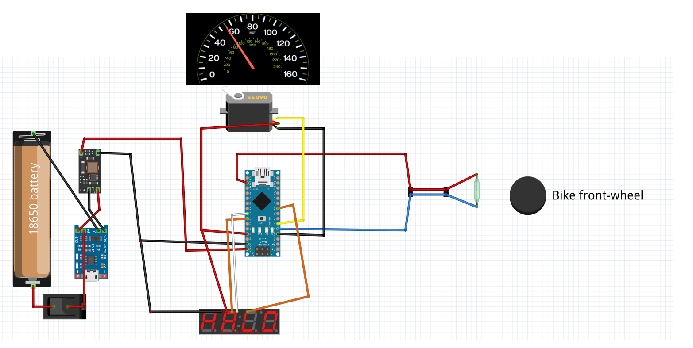

# Speedometer Project with Arduino

Learn to build a speedometer using Arduino! Using a reed switch and basic electronic components, track rotations of a rotating object like a bicycle wheel. Not only we want to create also 3d model for 3d printing all part that are necessary.

## Introduction
This project aims to create a speedometer using Arduino. By employing a reed switch and fundamental electronic components, we can effectively monitor rotations of a rotating object such as a bicycle wheel. Additionally, we plan to design 3D models for 3D printing all necessary parts.

## Electronic Scheme

In the electronic scheme of the project, we have the following components:
- Battery component
- Arduino Nano for logic
- Display to show velocity
- Analog display of velocity using a servo (suitable for children)
- Reed switch to measure rotation

## Mathematics
The mathematics behind this project is straightforward:

## Speed (km/h) = (2π * Radius of the wheel(cm) * Number of rotations) / Time interval(s) * 0.036

## Future Updates
In the next update, we plan to design a casing for the electronics and a support to connect to the bicycle.

